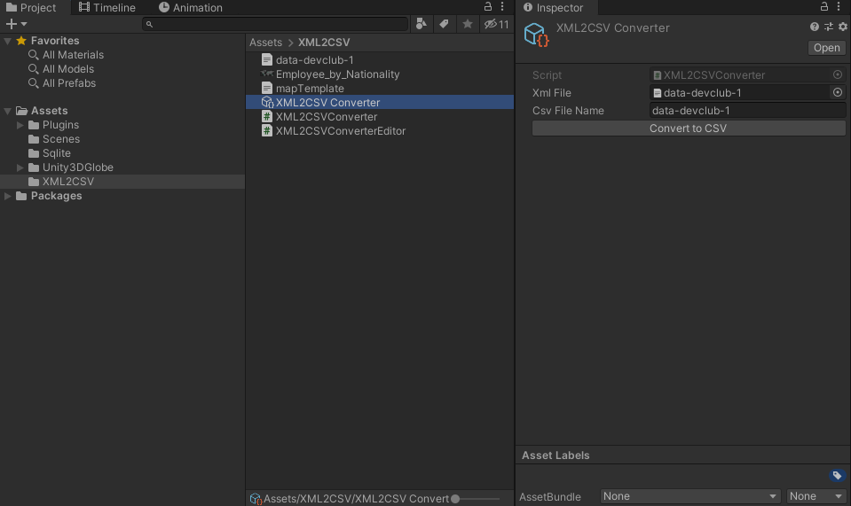
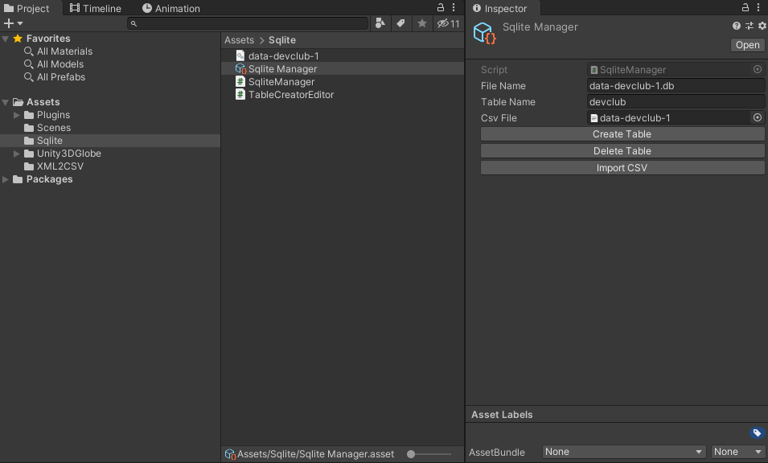

# hackathon-season2

## ใช้ Unity 2019.4.15f1 นะครับ ᕦ(ò_óˇ)ᕤ

# Happy New World ! 🎉🎉🎉

## ลง Unity ยังไง
https://learn.unity.com/tutorial/install-the-unity-hub-and-editor

## Usages
#### Click "Convert to CSV" ข้างขวาเพื่อแปลงไฟล์ XML ไปเป็น CSV

#### Click "Convert to CSV" ข้างขวาเพื่อแปลงไฟล์ XML ไปเป็น CSV

## Data Visualization

## เกณฑ์การให้คะแนน
- โค๊ดทำงานถูกต้อง 🛒
- Performance 🎎
  - Memory usage 🎨
  - Runtime benchmark 🧶
- Code อ่านง่าย 🎃
- ส่งเร็ว 🎏
- Creative ตอนทำ Data visualization 🎭
- ผลลัพธ์จาก SQLlite ต้องได้เป็น **JSON** format 👜

## ไม่มีทีมครับ
ทีม "โลก หมุนได้นะครับ"
สมาชิก
- [ShiragaP](https://github.com/ShiragaP)

Repo: [hackathon](https://github.com/ShiragaP/hackathon-season2)
