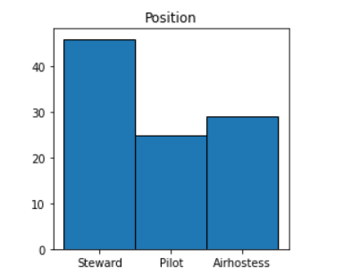
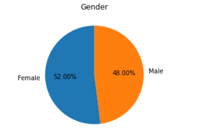
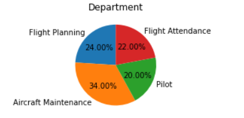
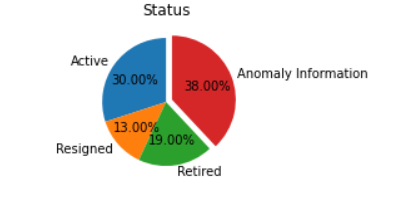
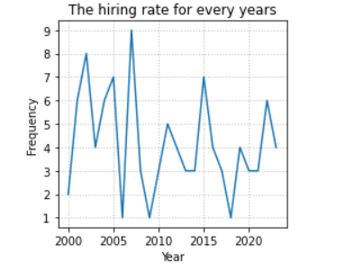
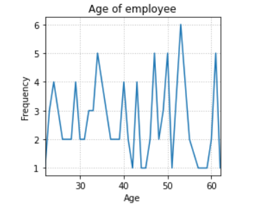
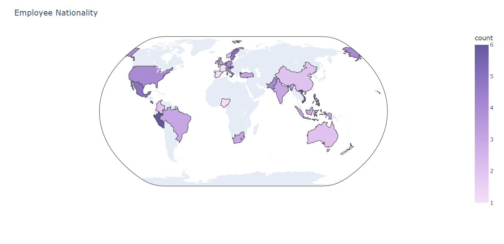
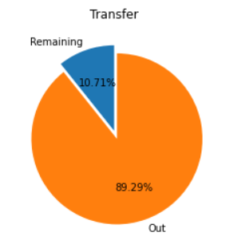
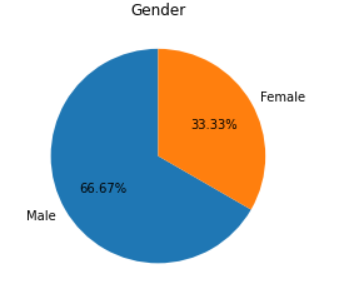
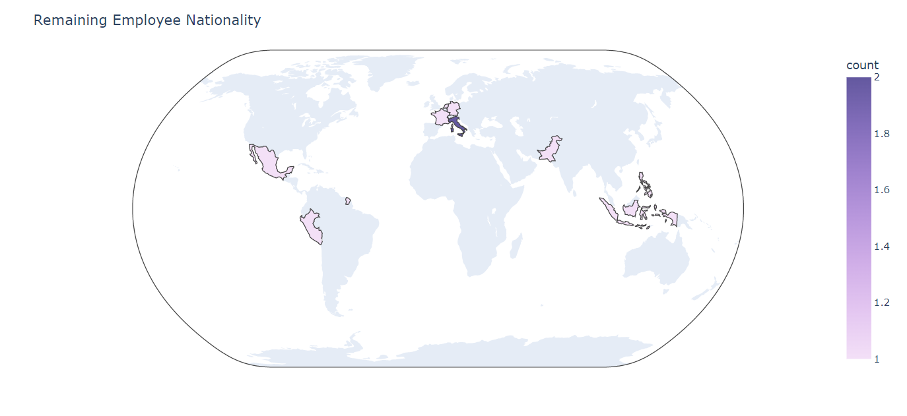

# hackathon-season2

## USAGE
To generate CSV from XML:
> python xml2csv.py

```text
usage: xml2csv.py [-h] [--xml XML] [--csv CSV] [--convert-default]

optional arguments:
  -h, --help         show this help message and exit
  --xml XML          Specify the name of a xml file to read from.
  --csv CSV          Specify the name of a csv file to write to.
  --convert-default  Convert active 3 years experience+ Airhostess, Pilot, Steward to csv file without duplicate ID and passport number.
```

To execute DAL and generate JSON:
> python csv2sqlite.py
```text
usage: csv2sqlite.py [-h] [--csv CSV] [--json JSON] [--database DATABASE] [--table-name TABLE_NAME] [--region-param REGION_PARAM] [--dept-param DEPT_PARAM] [--nation-param NATION_PARAM]

optional arguments:
  -h, --help            show this help message and exit
  --csv CSV             Specify a csv file.
  --json JSON           Specify a json outfile.
  --database DATABASE   Specify the name of a database file to write to.
  --table-name TABLE_NAME
                        Specify the name of a table
  --region-param REGION_PARAM
                        Specify parameter for SQLite View region-based query
  --dept-param DEPT_PARAM
                        Specify parameter for SQLite View department-based query
  --nation-param NATION_PARAM
                        Specify parameter for SQLite View nationality-based query

```

## เลข Status จะมีตามนี้ครับ
- 1 = Active
- 2 = Resigned
- 3 = Retired
- ถ้าเป็นเลขอื่นๆจะถือว่าเป็น anomaly information(**ข้อมูลที่ไม่ถูกต้อง**)

## เลข GENDER จะมีตามนี้ครับ
- 0 = Male
- 1 = Female
- ถ้าเป็นเลขอื่นๆจะถือว่าเป็น anomaly information(**ข้อมูลที่ไม่ถูกต้อง**)

## กฎระเบียบ

- ห้ามใช้ library สำหรับการทำ transformation จาก XML ไปเป็น CSV
- สามารถใช้ Driver ของตัวภาษานั้นๆ เพื่อต่อ SQLlite ได้
- ไม่อนุญาตให้ใช้ Tool สำเร็จรูป

## เกณฑ์การให้คะแนน

- โค๊ดทำงานถูกต้อง
- Performance
  - Memory usage
  - Runtime benchmark 
- Code อ่านง่าย
- ส่งเร็ว
- Creative ตอนทำ Data visualization 
- ผลลัพธ์จาก SQLlite ต้องได้เป็น **JSON** format

**Data visualization**

[Gender2 is data after database migration](data-visualization.ipynb)













## การสร้าง PR
ทีม นอนต่อเลยได้ไหม
สมาชิก
- [N.SX](https://github.com/rsxss)
- [Sathipp](https://github.com/Sathipp)
- [Jiruschai](https://github.com/JirusAnun)

Repo: [hackathon](https://github.com/rsxss/hackathon-season2)
